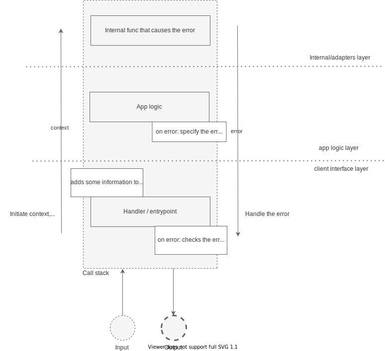

# Errors  [](https://goreportcard.com/report/github.com/nglogic/errors) [](http://godoc.org/github.com/nglogic/errors) [](https://gocover.io/github.com/nglogic/errors)

`errors` is a go package that defines the error type, which carries type information and some extra values for usage across API boundaries.

`errors` is designed to work nicely with standard go errors. It's not designed to replace the standard errors package in your project but rather to augment it. You can use `fmt.Errorf("%w")`, `errors.Is` and `errors.As` safely with it, just like standard errors.

## But why?

There is a standard way of passing context data down the call stack in go: the `context.Context`. It's used to carry deadlines and request-scoped data. The goal is to be able to carry some extra information across the API boundaries. For example, you can have a handler that stores requests id in the context. Then, down the stack, if you have to log something, you can log with the id extracted from the context (see the following diagram, the left side goes through the stack with a context). So there's a way to communicate between the handler layer and app layer.

But what if you want to pass information the other way in case of a failure? Look at the following diagram (the right side goes back the stack and caries an error). The only thing you have is an error.



The usual solution is to have a few sentinel errors and choose the action by comparing the errors to predefined sentinels by `errors.Is`. It works but isn't very flexible. Some example cases when it'll get tricky:

- You want to have a dynamic error messages. Sentinel errors don't allow it.
- You want to return a clean messages to the user and log all the error details internally.

This package gives you the tools to do these things easily.

## Types

The type describes a general error category. It is similar to HTTP status classes (like `4xx` or `5xx`).

The idea is that an error can carry a type across API boundaries. You can use this information to decide what is the proper way of handling the error.

```go
err := errors.New("file not found").WithType(errors.TypeNotFound)

---

if errors.IsType(errors.TypeNotFound) {
    // This is actually expected...
} else {
    // This is the bad case.
    log.Print(err)
}
```

### Creating custom type

There is a predefined list of the types that should be enough for the majority of use cases.
However, if you need a different one, adding it is as simple as defining a const:

```go
const MyTypeResourceExhausted errors.Type = "ResourceExhausted"
```

## Context values

You can assign any value to the error that is carried up the stack across API boundaries.
The purpose of this mechanism is to pass valuable information that can enhance error handling. For example:

- Error messages that the final user should get (or even language-aware messages),
- Extra data to log,
- In case of invalid input - extra error details that your app could return to the user to specify which input parameters were invalid,

We propose handling error values in your code by creating a pair of functions. The first one is for adding the value, the second one for fetching it. For example:

```go
const myErrValueKey  = "myValue"

func AddMyErrValue(err error, v string) error {
    return errors.From(err).WithValue(myErrValueKey, v)
}

func GetMyErrValue(err error) string {
    if v := errors.Value(myErrValueKey); v != nil {
        return v.(string)
    }
    return ""
}
```

Now just use the functions to write/read values where you need them :) The pattern is very similar to what you would do to handle values in context.

## Wrapping

This package works well with standard wrapping method:

```go
err := errors.New("testing error")
err = fmt.Errorf("something bad: %w", err)
```

You can still use standard errors `Is` and `As` methods to inspect error values. Unwrapping works too!
